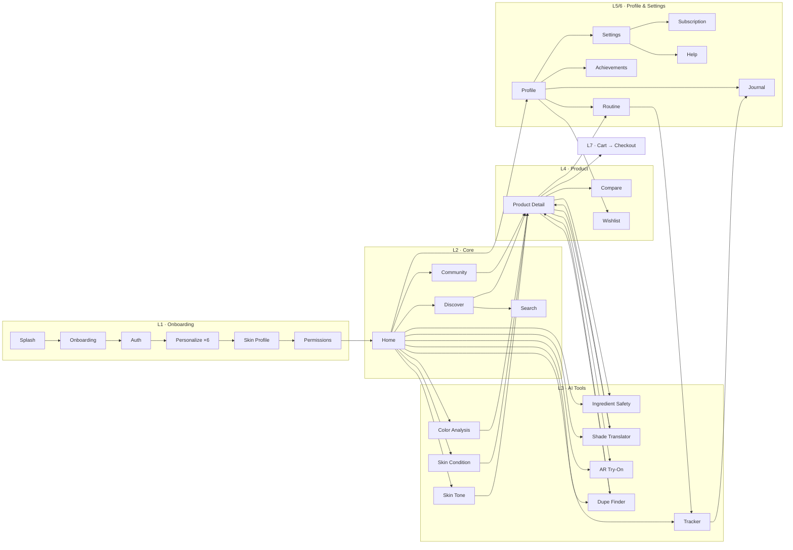

# AURA

**AURA is an AI-powered beauty and skincare companion for the Philippine market.** It combines on-device skin analysis, AR try-on, a skin-matched community, and a marketplace of FDA-verified products. Together these help people find products that actually work for their skin, safely and affordably, with no ads.

> **Project status:** Design phase. This repository currently contains the complete **interactive wireframe set** (105 screens across 10 layers) that defines the product. There is no application code yet; the wireframes are the source of truth for scope, flows, and behavior.

---

## Table of Contents

- [Mission & Principles](#mission--principles)
- [Viewing the Wireframes](#viewing-the-wireframes)
- [Repository Structure](#repository-structure)
- [Information Architecture](#information-architecture)
- [System Layers](#system-layers)
  - [Layer 1 · Onboarding & Auth](#layer-1--onboarding--auth)
  - [Layer 2 · Core Navigation](#layer-2--core-navigation)
  - [Layer 3 · AI Features](#layer-3--ai-features)
  - [Layer 4 · Product](#layer-4--product)
  - [Layer 5 · User Profile](#layer-5--user-profile)
  - [Layer 6 · Settings & Support](#layer-6--settings--support)
  - [Layer 7 · Commerce & Checkout](#layer-7--commerce--checkout)
  - [Layer 8 · Social, Brand & Learn](#layer-8--social-brand--learn)
  - [Layer 9 · Feature Deep-Dives](#layer-9--feature-deep-dives)
  - [Layer 10 · Edge Cases, Trust & Policy](#layer-10--edge-cases-trust--policy)
- [Core User Flows](#core-user-flows)
- [AI & Technical Approach](#ai--technical-approach)
- [Personalization Model](#personalization-model)
- [Trust, Safety & Compliance](#trust-safety--compliance)
- [Monetization](#monetization)
- [Design System](#design-system)
- [Wireframe Toolkit (for contributors)](#wireframe-toolkit-for-contributors)
- [Screen Index](#screen-index)

---

## Mission & Principles

AURA is built around a health-and-equity mission (SDG-aligned): beauty guidance that works for **every skin tone and budget**, grounded in **safety**.

| Principle | What it means in the product |
|---|---|
| **Inclusive by default** | Skin tone uses the Monk Skin Tone scale; looks draw on makeup cultures worldwide; recommendations are ranked by *your* skin, not a default one. |
| **Safety first** | Every listed product is **FDA-registered / CPNN-verified**. Ingredients are checked against *your* sensitivities, pregnancy, and age context. |
| **Private** | Skin and color analysis run **on-device**. Face scans and photos are covered by explicit consent toggles, plus download-all and delete-all rights. |
| **Honest AI** | Every AI result shows a confidence score and the reasons behind it, and can be flagged as wrong. AURA is guidance, **not a medical diagnosis**. |
| **Free core, no ads** | The essential tools are free permanently. Premium (Aura+) only adds features on top. No advertising. |
| **Affordable** | The dupe finder, per-product budgets, and price-drop alerts help people get results without overspending. |
| **User stays in control** | AI never silently overwrites what the user told it. Conflicts between the user's answers and scan results are shown side by side for the user to resolve. |

---

## Viewing the Wireframes

The wireframes are a self-contained React app that runs in the browser. There is no build step: React, ReactDOM, and Babel load from a CDN, and the JSX files are transpiled in the browser.

```bash
git clone https://github.com/Yeeejj/AURA.git
cd AURA/design

# Serve the folder over HTTP (browsers block local file:// script loading)
npx serve .
# or
python -m http.server 8000
```

Then open **`Aura Wireframes.html`** (e.g. `http://localhost:8000/Aura%20Wireframes.html`).

**Canvas controls**
- Pan and zoom around a Figma-style canvas grouped into sections (one per layer).
- Drag an artboard by its grip to reorder it; artboard titles and labels can be edited inline.
- Open any artboard in **fullscreen focus mode**, then use `←` / `→` to step through screens and `Esc` to exit.
- Canvas state (ordering, labels) is saved to `.design-canvas.state.json`.

**Print / PDF:** `Aura Wireframes-print-60x4zw.html` is a print-optimized version for exporting the full set to PDF.

---

## Repository Structure

```
AURA/
├── README.md
└── design/
    ├── Aura Wireframes.html            # Entry point: composes every screen onto the canvas
    ├── Aura Wireframes-print-*.html    # Print/PDF export variant
    ├── design-canvas.jsx               # Canvas shell: DesignCanvas, DCSection, DCArtboard, DCPostIt
    ├── wireframe-kit.jsx               # Design tokens + UI primitives + annotated phone Frame
    ├── flowmap.jsx                     # Node/edge flow map of the core screens
    ├── screens-l1l2.jsx                # L1 Onboarding & Auth, L2 Home/Discover/Search/Reels, Component Sheet
    ├── screens-community.jsx           # L2 Community hub, tutorials, saved library, create, browse, creators
    ├── screens-l3a.jsx                 # L3 Skin Tone, Skin Condition, Ingredient Safety, Color Analysis
    ├── screens-l3b.jsx                 # L3 Shade Translator, AR Try-On, Dupe Finder, Tracker
    ├── screens-l456.jsx                # L4 Product, L5 Profile, L6 Settings
    ├── screens-l4-plus.jsx             # L4+ redesigned Product layer & product-context AR studio
    ├── screens-commerce.jsx            # L7 Cart → Checkout → Shipping → Address → Payment → Tracking; Create Routine
    ├── screens-social.jsx              # L8 Public/Brand profiles, Brand sales, Messages, Notifications, Learn, Favorites
    ├── screens-feat-a.jsx              # L9 Messaging, Brand Shade, Ingredient×Profile, Skin Card, Tracker B/A, Image Search
    ├── screens-feat-b.jsx              # L9 Makeup Looks, Shop the Look, Budget, Reviews, MOTD, Social, Account Roles
    ├── screens-feat-c.jsx              # L10 Conflicts, Conditions, Routine cadence, Tiers, Age, Privacy, Support, Trust
    ├── .design-canvas.state.json       # Persisted canvas state
    ├── .thumbnail                      # Canvas preview image
    └── AURA.zip                        # Archived bundle of the design set
```

Each screen is a React component wrapped in an annotated `Frame`. The 390×844 phone mockup sits on the left, and an annotation column on the right documents the screen's **Purpose**, **Key Components**, **States** (e.g. loading / empty / error), and **Flow** (where it leads).

---

## Information Architecture

### Primary navigation

A 5-tab bottom bar, with **Scan** raised in the center as the main AI entry point:

| Tab | Destination |
|---|---|
| ⌂ **Home** | Personalized dashboard (L2-06) |
| ◎ **Discover** | FDA-verified product browse (L2-07) |
| ◉ **Scan** | AI tools launcher (Layer 3) |
| ◈ **Community** | Skin-matched social hub (L2-26) |
| ◐ **Profile** | Identity, routine, tracker, history, settings (L5) |

> Routine is **not** a tab: it lives under *Profile → My Routine & Tracker*.

### Flow map (core paths)



---

## System Layers

### Layer 1 · Onboarding & Auth
*Splash → Onboarding → Auth → Personalize (6 steps) → Skin Profile → Permissions → Home*

| ID | Screen | Purpose |
|---|---|---|
| L1-01 | Splash | Brand entry while the app boots and restores the session. |
| L1-02 | Onboarding Carousel | 3–4 slides: value prop, SDG health and equity mission, free-tier promise. |
| L1-03 | Sign Up / Log In | Email + social auth (Firebase), sign-up/login toggle, guest skip, validation errors. |
| L1-03b | Personalize · Looks (1/6) | Aesthetics the user loves, drawn from makeup cultures worldwide. |
| L1-03c | Personalize · Skincare (2/6) | Routine consistency → paces routine suggestions. |
| L1-03d | Personalize · Makeup freq (3/6) | How often makeup is worn → balances makeup vs. skincare content. |
| L1-03d2 | Personalize · Skill level (4/6) | Separate Beginner/Intermediate/Advanced for skincare **and** makeup → depth of guidance. |
| L1-03e | Personalize · Lifestyle (5/6) | Activity level → longevity/transfer-proof picks and timing. |
| L1-03f | Personalize · Time (6/6) | Time available → routine length; seeds the AI engine. |
| L1-04 | Skin Profile Setup | Multi-step skin questionnaire used across every module. |
| L1-05 | Permissions Primer | Explains camera use *before* the OS prompt, to raise grant rates. |

### Layer 2 · Core Navigation

| ID | Screen | Purpose |
|---|---|---|
| L2-06 | Home / Dashboard | Profile snapshot, 8 AI-tool launchers, tracker continuation, picks, no-ads reassurance. |
| L2-26 | Community Hub | Photos, videos, tutorials, tips, and recommendations ranked by match to the user's skin condition and palette; each card shows *why* it matches. |
| L2-26b | Community Reels | Full-screen "For Your Skin" reels; every post is shoppable via the gold basket. |
| L2-26c | Tutorial / Post Detail | Skin-fit score, shoppable FDA-verified products used, step-by-step, creator tips. |
| L2-26d | Saved Library | Personal archive of saved and posted content, organized into collections. |
| L2-26e | Create / Upload | Photo/video/tutorial/tip composer; tag skin condition, palette, and products. |
| L2-26f | Browse by Skin | Community directory by condition and undertone; user's own matches highlighted. |
| L2-26g | Creators / Following | Suggested creators ranked by skin-profile similarity; following list. |
| L2-07 | Discover / Explore | FDA-verified product feed in category rails. |
| L2-08 | Search & Filter | Search + filter sheet (price, concern, brand, shade, FDA-only). |

### Layer 3 · AI Features
Eight AI modules. Each follows a consistent **Capture/Entry → Processing → Result** pattern.

| ID | Module | How it works | Result |
|---|---|---|---|
| L3-09 | **Skin Tone** | Well-lit selfie with a guide overlay and lighting hint; **on-device** classification. | Monk Skin Tone match + confidence; "use everywhere" CTA. |
| L3-10 | **Skin Condition** | Face scan with region guide; detects concerns per facial region. | Concerns + confidence + suggested ingredient directions (*not medical advice*). |
| L3-11 | **Ingredient Safety** | Scan a label (OCR) or search an ingredient by name. | Per-ingredient safety ratings (EWG/CIR-style); flagged items expand. |
| L3-12 | **Shade Translator** | Pick a shade the user already knows. | Cross-brand equivalents ranked by perceptual color distance (**CIELAB ΔE**), FDA badge on each. |
| L3-13 | **AR Try-On** | Live camera, face-mesh lock, **PBR** product overlay; shade + intensity controls. | Captured look → save, share, or add to routine. |
| L3-14 | **Dupe Finder** | Target product + budget cap. | Alternatives ranked by ingredient + performance similarity with ₱ savings. |
| L3-15 | **Tracker** | 30-day tracker: daily photo, routine check-off, notes, reminders. | Timeline, before/after slider, streak. |
| L3-27 | **Color Analysis** | Bare-faced daylight selfie; samples skin, eye, and hair color **on-device**. | Season (of 12) + undertone, flattering palette, recommended look, shoppable products. |

### Layer 4 · Product

**Baseline**

| ID | Screen | Purpose |
|---|---|---|
| L4-16 | Product Detail | Full record (example: hybrid tinted-serum foundation); FDA + CPNN trust block; looks featuring this product. |
| L4-17 | Product Comparison | 2–3 products across ingredients, safety, price, shade match. |
| L4-19 | Wishlist / Saved | Saved grid with quick actions and empty state. |

**Redesigned (L4+)**: AR Try-On becomes a main action on the product page, not a tool buried in Layer 3.

| ID | Screen | Purpose |
|---|---|---|
| L4+-16 | Product Detail v2 | Live AR tile in gallery + persistent AR button, pre-loaded with this product and matched shade. |
| L4+-AR1 | AR · Live filter | Real-time product-as-filter; product pinned on top, shade rail and intensity at the bottom. |
| L4+-AR2 | AR · Shade & filter studio | Full shade grid (AI-match flagged), finish (matte/satin/dewy/gloss), intensity, warmth, stacked layers for a full face. |
| L4+-AR3 | AR · Before/After & capture | Wipe between bare and applied → add exact shades to cart, save look, share as MOTD. |
| L4+-16b | Reviews (skin-matched) | "People like you" filter; ratings split by skin profile; AR-tagged photo reviews. |
| L4+-16c | Ingredients & safety | Profile-aware breakdown, flags first, plain-language function tags. |
| L4+-17 | Compare + AR both | Visual compare with shade-match row; try both in AR; user can change the deciding metric. |
| L4+-19 | Saved v2 | Shortlist with AR-tried flags, price drops on top, direct to AR or cart. |

### Layer 5 · User Profile

| ID | Screen | Purpose |
|---|---|---|
| L5-20 | Profile Home | Identity + skin-profile summary; shortcuts to history, achievements, edit. |
| L5-18 | My Routine | AM/PM routine with ordered steps. |
| L5-18b | Create Routine | Name, AM/PM, reminder, ordered steps from search or scans. |
| L5-21 | Skin Journal / History | Chronological log of scans and tracker entries, filterable by module. |
| L5-22 | Achievements | Milestones, streaks, journey badges, with only light gamification. |

### Layer 6 · Settings & Support

| ID | Screen | Purpose |
|---|---|---|
| L6-23 | Settings | Account, notifications, privacy and data controls (RA 10173), theme, sign-out. |
| L6-24 | Subscription / Plans | Free tier first and permanent; premium is additive; explicit no-ads. |
| L6-25 | Help & Support | Searchable FAQ; FDA-verification explainer; mission statement. |

### Layer 7 · Commerce & Checkout
*Cart → Review → Shipping → Address → Map → Payment → Tracking*

| ID | Screen | Purpose |
|---|---|---|
| L7-28 | Cart | Marketplace cart grouped by seller; FDA badges per line; free-shipping progress; sticky checkout. |
| L7-29 | Checkout Review | Recap of address, shipping, payment, and items with edit links; full price breakdown; place order. |
| L7-30 | Shipping | Address + courier selection with ETA and cost. |
| L7-31 | Inserting Address | PH **Region → Province → City → Barangay** hierarchy; pin-on-map; label; default toggle. |
| L7-32 | Maps Page | Drag-to-pin with reverse geocoding back into the form. |
| L7-33 | Payment | **GCash, Maya** first, then cards and **COD**. |
| L7-34 | Order Tracking | Vertical timeline, courier card, map snippet, ETA, parcel items. |

### Layer 8 · Social, Brand & Learn

| ID | Screen | Purpose |
|---|---|---|
| L8-35 | Public Profile | Creator profile: follow, message, public skin profile, posts/routines/reviews. |
| L8-36 | Brand Profile | In-app storefront led by FDA-registered-distributor status. |
| L8-37 | Brand Sales Analysis | Seller portal: revenue and order KPIs, trend chart, top products, FDA-compliance health. |
| L8-38 | Messages | Inbox with brands, creators, and the Aura assistant. |
| L8-39 | Notifications | Time-grouped feed: orders, social, tracker reminders, brand drops. |
| L8-40 | Learn | Ingredient science, routine guides, FDA and safety literacy track. |
| L8-41 | Favorites | Collection boards ("Want to try", "Holy grails"). |

### Layer 9 · Feature Deep-Dives

| ID | Screen | Purpose |
|---|---|---|
| F-42 | Messaging — Thread | Shoppable, order-aware chat with product/order cards and quick replies. |
| F-43 | Brand Shade Translator | User's exact shade within one brand's line, with nearest alternatives. |
| F-44 | Ingredient Safety × Profile | Flags judged against the user's own profile (acne-prone, sensitive, pregnancy, allergies). |
| F-45 | Skin Color Card (PNG) | Shareable/downloadable card of tone and color results. |
| F-46 | Tracker Before & After | Day 1 vs. latest with an AI read-out of measurable change. |
| F-47 | Progress Video Reel | Time-lapse reel with auto-aligned faces, music, milestone captions. |
| F-48 | Search by Image | Photo of packaging → catalog match or FDA-verified equivalents. |
| F-49 / F-49b | Makeup Looks | Beginner (tutorials on) vs. Advanced (tutorials hidden), driven by skill level. |
| F-50 | Shop the Look | Full product list behind a look; add individually or add all. |
| F-51 | Specific Product Budget | Target price, price history, ad-free drop alerts, or jump to a dupe. |
| F-52 | Write Review | Product **and** seller review; auto-tags reviewer's skin profile; photos. |
| F-53 | Share your MOTD | Makeup of the Day with shoppable product stickers; post in-app or externally. |
| F-54 | Social Interaction | Reactions, threaded comments, creator pin, share sheet that keeps posts shoppable. |
| F-55 | Account Roles | One account, two roles: shoppers can apply to become verified Brand/sellers. |

### Layer 10 · Edge Cases, Trust & Policy

| ID | Screen | Purpose |
|---|---|---|
| P-56 | Profile Conflict | Self-declared vs. scan-detected values side by side with confidence: keep, accept, or blend. |
| P-57 | Skin Condition Categories | Curate tracked conditions (self-added or detected) with adjustable severity; re-tunes the app. |
| P-58 | Daily Routine | AM/PM every-day steps; cadence toggle. |
| P-58b | Weekly Routine | Exfoliants/masks/treatments on set days; actives auto-spaced to avoid irritation. |
| P-59 | Free vs Paid Tier | Feature matrix, monthly/yearly pricing, no-pressure "stay free" path. |
| P-60 | Age Appropriate | DOB check; under-18 gets gentler routines, hides strong actives, guardian consent for purchases. |
| P-61 | Security & Data Privacy | Consent toggles for face scans/photos/biometrics; encryption and retention; download and delete everything. |
| P-62 | Customer Support | Search-first FAQ, live chat, email, ticket tracking. |
| P-63 | Bug Reports | Structured report with screenshot/recording and auto-attached device/app context. |
| P-64 | Feature Requests | Public ideas board with voting; Under review → Planned → Shipped. |
| P-65 | System Accuracy | Confidence and reasons, flag inaccurate results, "guidance, not diagnosis". |
| P-66 | Fake Accounts & Products | Seller FDA-registration checks, counterfeit and impersonation reports, verified badges. |

---

## Core User Flows

1. **First run:** Splash → Onboarding → Auth → 6-step personalization → Skin Profile → Camera permission → Home.
2. **Know your skin:** Home/Scan → Skin Tone + Skin Condition + Color Analysis → results saved to profile → shareable Skin Color Card.
3. **Product discovery → purchase:** Discover/Search/Community → Product Detail → AR Try-On → Ingredient check → Compare → Cart → Checkout → Payment → Order Tracking.
4. **AR → commerce/social loop:** Product → Live AR → Shade & finish studio → Before/After capture → add exact shades to cart *or* share as MOTD.
5. **Routine & progress:** Profile → My Routine (daily + weekly cadence) → 30-day Tracker → daily log → Before/After + progress reel → Journal.
6. **Save money:** Product → Dupe Finder / Product Budget → price-drop alert → Saved → Cart.
7. **Community:** For-Your-Skin feed/reels → tutorial detail → Shop the Look; create posts tagged by skin profile; follow skin-matched creators.
8. **Become a seller:** Account Roles → verified Brand → Brand storefront + Sales Analysis.

---

## AI & Technical Approach

These choices are specified in the wireframe annotations:

| Area | Approach |
|---|---|
| Skin tone classification | On-device model mapped to the **Monk Skin Tone (MST)** scale, with confidence. |
| Skin condition detection | Region-based facial analysis; outputs concerns + confidence + ingredient directions. |
| Color analysis | On-device sampling of skin/eye/hair color matched against **12 seasonal palettes** + undertone. |
| Shade matching | Perceptual color distance (**CIELAB ΔE**) against a cross-brand shade library. |
| AR try-on | Face-mesh tracking + **physically based rendering (PBR)** overlays; layered products, finish, intensity, warmth. |
| Ingredient safety | **OCR** on labels + safety lookup (EWG/CIR-style ratings), evaluated against the user's profile. |
| Dupe finding | Similarity on ingredients + performance, constrained by budget. |
| Visual search | Image match from product/packaging photos. |
| Authentication | Email + social sign-in via **Firebase**; guest mode. |
| Feedback loop | Users can flag inaccurate results to improve the models. |

---

## Personalization Model

Every surface in AURA is ranked against a single user profile built from:

- **Onboarding answers:** preferred looks, skincare consistency, makeup frequency, skill level (separately for skincare and makeup), lifestyle, time available.
- **Skin profile:** type, concerns/conditions (with severity), sensitivities, allergies, pregnancy and age context.
- **AI results:** MST tone, undertone, seasonal palette, detected conditions.

This profile is used to:
- rank the Community feed, creators, and reviews ("people like you"),
- flag ingredients against the user's own sensitivities,
- pre-select shades in AR and the shade translator,
- set the depth of tutorials (beginner vs. advanced) and the length of routines,
- space out weekly actives in the routine.

When the user's own answers and scan results disagree, AURA shows both for the user to resolve (P-56) and never changes the profile without asking.

---

## Trust, Safety & Compliance

- **FDA Philippines registration / CPNN verification** on every product and seller; failing listings are flagged.
- **Data Privacy Act of 2012 (RA 10173):** granular consent, encryption, retention notes, full export and deletion.
- **On-device processing** for face and skin analysis wherever possible.
- **Age-appropriate experience** with guardian consent for minors' purchases.
- **Counterfeit and impersonation reporting** with verified badges.
- **Clear disclaimer** that AI output is guidance, not medical diagnosis.

---

## Monetization

- **Free tier (permanent):** all core AI tools, community, and shopping.
- **Aura+ (premium):** additive features, with a clear feature matrix and monthly/yearly pricing (P-59, L6-24).
- **Marketplace:** brands sell through verified storefronts with seller analytics.
- **No ads, ever.** Price-drop alerts are ad-free.

---

## Design System

Warm, editorial look with a Filipino-inspired palette, defined in `wireframe-kit.jsx` (`WK` tokens, OKLCH):

| Token | Role |
|---|---|
| `ink` | Cocoa charcoal: primary text, strong strokes |
| `mid` / `faint` / `line` | Secondary text, hairlines, dashed borders |
| `paper` / `panel` / `panel2` | Ivory device background and fills |
| `accent` / `accentBg` / `accentInk` | **Deep rose**: primary actions |
| `gold` / `goldBg` / `goldInk` | **Antique gold**: AI, premium, and "matches you" highlights |
| `rose` | Bright rose highlight |

**Typography:** *Fraunces* (serif display) + *Inter* (UI sans), via Google Fonts.

**Recurring visual signals**
- **FDA badge:** product/seller verification.
- **Gold:** AI output, skin-match, premium.
- **Gold basket:** "Shop the Look" from any look or post.
- **Confidence meter:** shown on every AI result.

---

## Wireframe Toolkit (for contributors)

**Canvas (`design-canvas.jsx`):** `DesignCanvas`, `DCSection`, `DCArtboard`, `DCPostIt`.

**Primitives (`wireframe-kit.jsx`):**

| Group | Components |
|---|---|
| Frame & chrome | `Frame` (phone + annotation column), `Phone`, `StatusBar`, `AppBar`, `TabBar`, `Body` |
| Content | `H`, `Txt`, `TLine`, `TLines`, `Ph` (placeholder), `SecLabel`, `Row`, `Card` |
| Controls | `Btn`, `Chip`, `Dots`, `ProgBar` |
| Domain | `FDABadge`, `ProductCard`, `AICard`, `Confidence`, `Processing`, `CameraFrame`, `Banner` |
| States | `Empty`, `ErrorBlock`, `StateTag` |

**Adding a screen**

1. Write a component in the relevant `screens-*.jsx` file and wrap it in `Frame`:
   ```jsx
   function MyScreen() {
     return (
       <Frame
         purpose="What this screen is for."
         components={['Key component A', 'Key component B']}
         states={['default', 'loading', 'empty', 'error']}
         flows={['Primary CTA → Next screen']}
       >
         <Phone tab="home">{/* AppBar, Body, … */}</Phone>
       </Frame>
     );
   }
   ```
2. Add it as an artboard in `Aura Wireframes.html` (artboards are `670×844`: 390 px phone + annotation column):
   ```jsx
   <DCArtboard id="L5-23" label="L5-23 · My Screen" width={670} height={844}><MyScreen /></DCArtboard>
   ```
3. If you created a new file, include it with a `<script type="text/babel" src="…">` tag **before** the inline `App` script.

**ID convention:** `L<layer>-<nn>[letter]` for layered screens, `L4P-` for the L4 redesign, `F-` for feature deep-dives, `P-` for policy/edge cases. Letters `a/b/c` mark Capture → Processing → Result within an AI module.

---

## Screen Index

| Section | Screens |
|---|---|
| Reference | Component Sheet, Flow Map |
| L1 · Onboarding & Auth | 11 |
| L2 · Core Navigation | 10 |
| L3 · AI Features | 24 (8 modules × 3 states) |
| L4 · Product | 3 |
| L4+ · Product Redesigned | 8 |
| L5 · User Profile | 5 |
| L6 · Settings & Support | 3 |
| L7 · Commerce & Checkout | 7 |
| L8 · Social, Brand & Learn | 7 |
| L9 · Feature Deep-Dives | 15 |
| L10 · Edge Cases, Trust & Policy | 12 |
| **Total** | **105 screens** + 2 reference boards |
